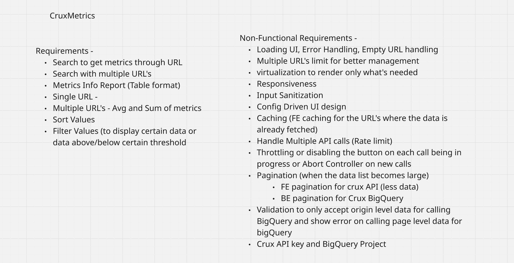
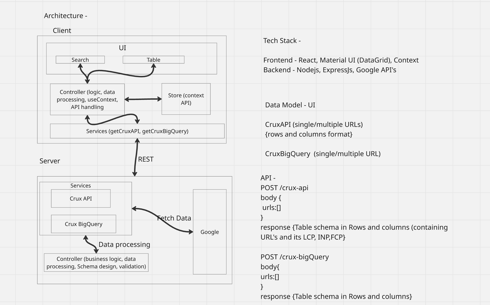
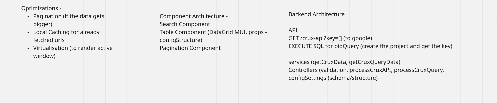

# CruxMetrics - Implementation Plan

## Project Overview

CruxMetrics is a performance analytics tool that leverages Google Chrome UX Report (CrUX) data to help identify and fix website slowness issues. The application supports single and multiple URL analysis with filtering, sorting, and aggregation capabilities.

---

## Design Image





## Architecture Overview

### System Design

```
Client (React)
├── UI Components (Search, Table, Pagination)
├── Controller (Logic, Data Processing, useContext)
├── Store (Context API)
└── Services (API Calls, Caching)
        ↓ REST API ↓
Server (Node.js/Express)
├── Controllers (Validation, Business Logic)
├── Services (CrUX API, BigQuery)
└── Google APIs (Fetch Data)
```

---

## Architecture Review & Suggested Enhancements

### ✅ Strengths

- Clear separation of concerns (UI → Controller → Services → APIs)
- Context API for state management is lightweight and appropriate
- Two-tier API approach (CrUX API for quick results, BigQuery for deeper analysis)
- Comprehensive non-functional requirements considered

### 💡 Suggested Improvements

| Area                   | Suggestion                                     | Reason                                    |
| ---------------------- | ---------------------------------------------- | ----------------------------------------- |
| **API Keys**           | Use environment variables + .env for both APIs | Security, flexibility across environments |
| **Request Management** | Implement request deduplication cache          | Prevent duplicate simultaneous API calls  |
| **Error Handling**     | Create custom error boundary component         | Graceful failure UX                       |
| **Data Validation**    | Use Zod or JSON Schema for response validation | Type safety, schema validation            |
| **Caching Strategy**   | Implement cache metadata (timestamp, TTL)      | Know when to invalidate                   |
| **Rate Limiting**      | Queue system for multiple URL requests         | Better handling than simple throttling    |
| **Logging**            | Add structured logging on BE                   | Better debugging and monitoring           |

---

## Detailed Implementation Roadmap

### Phase 1: Backend Foundation (Days 1-2)

#### 1.1 Setup Environment & Dependencies

```bash
Backend Dependencies:
- express (API framework)
- axios (HTTP client for Google APIs)
- dotenv (environment variables)
- cors (cross-origin requests)
- express-validator (input validation)
- google-auth-library (Google API auth)
- @google-cloud/bigquery (BigQuery client)
```

#### 1.2 Create Controller Layer

**Files to create:**

- `backend/controllers/cruxController.js`
- `backend/controllers/validationController.js`

**Responsibilities:**

- POST `/api/crux-api` - CrUX API endpoint
- POST `/api/crux-bigquery` - BigQuery endpoint
- Input validation & sanitization
- Origin-level validation for BigQuery (reject page-level URLs)
- Response formatting

#### 1.3 Create Services Layer

**Files to create:**

- `backend/services/cruxService.js` - CrUX API calls
- `backend/services/bigQueryService.js` - BigQuery SQL execution
- `backend/services/responseProcessor.js` - Convert to rows/columns format
- `backend/utils/errorHandler.js` - Centralized error handling
- `backend/utils/logger.js` - Structured logging

#### 1.4 Error Handling & Logging

- Error wrapper middleware
- Custom error classes
- Structured logging (timestamps, levels, context)
- API error response standardization

---

### Phase 2: Frontend Components (Days 2-3)

#### 2.1 State Management (Context API)

**Files to create:**

- `frontend/src/context/MetricsContext.jsx` - Main data context
- `frontend/src/context/UICacheContext.jsx` - URL caching logic

**Context Structure:**

```javascript
// MetricsContext
{
  data: { rows: [], columns: [], aggregated: {} },
  loading: boolean,
  error: string | null,
  filters: { column: string, type: 'threshold' | 'range', value: any },
  sort: { field: string, direction: 'asc' | 'desc' },
  pagination: { pageSize: 10, pageNumber: 1, totalRows: 0 }
}

// CacheContext
{
  cache: Map<string, { data, timestamp, ttl }>,
  addToCache: (url, data) => void,
  getFromCache: (url) => data | null,
  invalidateCache: (url) => void
}
```

#### 2.2 Core Components

**Files to create:**

- `frontend/src/components/SearchComponent.jsx`
  - Multiple URL input field
  - API source selector (CrUX API / BigQuery)
  - Search button with loading state
  - Input validation UI feedback

- `frontend/src/components/TableComponent.jsx`
  - MUI DataGrid (config-driven columns)
  - Responsive design
  - Sortable columns
  - Filterable data

- `frontend/src/components/PaginationComponent.jsx`
  - Page size selector
  - Navigation buttons
  - Page info display

- `frontend/src/components/LoadingSpinner.jsx`
  - Skeleton loaders for table
  - Loading states

- `frontend/src/components/ErrorBoundary.jsx`
  - Catch errors gracefully
  - User-friendly error messages

- `frontend/src/components/EmptyState.jsx`
  - Empty state UI when no data

#### 2.3 Custom Hooks

**Files to create:**

- `frontend/src/hooks/useCruxAPI.js`
  - Fetch data + cache logic
  - Deduplication handling

- `frontend/src/hooks/useFilters.js`
  - Filter state management
  - Threshold-based filtering

- `frontend/src/hooks/useSort.js`
  - Sort state management
  - Multi-column sorting

- `frontend/src/hooks/usePagination.js`
  - Pagination logic
  - Page calculations

- `frontend/src/hooks/useAbortController.js`
  - Cancel active requests on new search
  - Cleanup on unmount

---

### Phase 3: Advanced Features (Days 3-4)

#### 3.1 Filtering & Sorting

- Dynamic filter UI based on available metrics
- Threshold-based filtering (e.g., LCP > 2.5 seconds)
- Multi-column sort capability
- Preset filter templates (Good/Needs Improvement/Poor)

#### 3.2 Caching System

**Frontend Cache:**

```javascript
// Structure: Map<URL, { data, timestamp, ttl }>
{
  "https://example.com": {
    data: { rows: [], columns: [] },
    timestamp: 1646000000,
    ttl: 300000 // 5 minutes
  }
}
```

- Display "Cached data from X mins ago" indicator
- Manual cache refresh button
- Automatic invalidation on TTL expiry

**Backend Cache (Optional):**

- Cache CrUX API responses for 1 hour
- Reduce unnecessary Google API calls

#### 3.3 Rate Limiting & Throttling

- AbortController on new requests (cancels previous requests)
- Button disabled state while loading
- Visual feedback (loading spinner, disabled input)
- Queue system for batch requests (max 3-5 parallel)

#### 3.4 Data Processing

**Aggregation Functions:**

```javascript
// For multiple URLs
{
  avg: { lcp: 2.1, inp: 100, fcp: 1.5, ... },
  sum: { lcp: 10.5, inp: 500, fcp: 7.5, ... },
  count: 5,
  min: { lcp: 1.8, ... },
  max: { lcp: 3.2, ... }
}
```

---

### Phase 4: Optimization & Polish (Days 4-5)

#### 4.1 Virtualization

- Use `react-window` or `react-virtual` for large datasets
- Render only visible rows in viewport
- Improves performance for 1000+ rows

#### 4.2 Responsive Design

- Mobile-first approach
- Breakpoints: sm (640px), md (900px), lg (1200px)
- Stack layout on mobile
- Horizontal scroll for tables on small screens

#### 4.3 Configuration-Driven UI

**Create `frontend/src/config/metricsConfig.js`:**

```javascript
{
  columns: [
    {
      field: 'url',
      headerName: 'URL',
      width: 300,
      editable: false
    },
    {
      field: 'lcp',
      headerName: 'LCP (seconds)',
      width: 150,
      type: 'number',
      threshold: { good: 2.5, poor: 4.0 }
    },
    // ... more columns
  ],
  thresholds: {
    lcp: { good: 2.5, meetsThreshold: 4.0 },
    inp: { good: 200, meetsThreshold: 500 },
    fcp: { good: 1.8, meetsThreshold: 3.0 }
  },
  colors: {
    good: '#4caf50',
    meetsThreshold: '#ff9800',
    poor: '#f44336'
  }
}
```

#### 4.4 Testing & Documentation

- Error scenario testing
- Edge case validation
- Update README with architecture and usage

---

## Data Model & API Contracts

### Backend Response Schema

#### CrUX API Response (POST /api/crux-api)

```json
{
  "success": true,
  "source": "crux-api",
  "data": {
    "rows": [
      {
        "url": "https://example.com",
        "lcp": "2.1s",
        "inp": "90ms",
        "fcp": "1.2s",
        "cls": "0.05",
        "percentile_75_lcp": "2.5",
        "percentile_75_inp": "110",
        "percentile_75_fcp": "1.5"
      }
    ],
    "columns": [
      { "field": "url", "headerName": "URL", "width": 300 },
      { "field": "lcp", "headerName": "LCP (seconds)", "width": 150 }
    ]
  },
  "pagination": {
    "totalRows": 1,
    "pageSize": 10,
    "pageNumber": 1
  },
  "cachedAt": null
}
```

#### CrUX BigQuery Response (POST /api/crux-bigquery)

```json
{
  "success": true,
  "source": "crux-bigquery",
  "data": {
    "rows": [
      {
        "url": "https://example.com",
        "lcp_good": "85%",
        "lcp_poor": "5%",
        "inp_good": "90%",
        "inp_poor": "2%",
        "count": 50000
      }
    ],
    "columns": [
      { "field": "url", "headerName": "URL", "width": 300 },
      { "field": "lcp_good", "headerName": "LCP Good", "width": 120 }
    ],
    "aggregated": {
      "url": "Multiple URLs (3)",
      "avg_lcp_good": "82%",
      "sum_lcp_good": "246%",
      "count": 3
    }
  },
  "pagination": {
    "totalRows": 3,
    "pageSize": 10,
    "pageNumber": 1
  }
}
```

#### Error Response

```json
{
  "success": false,
  "source": "crux-api",
  "error": "Invalid URL provided",
  "errorCode": "INVALID_URL",
  "message": "Please provide a valid origin-level URL",
  "timestamp": "2024-03-02T10:30:00Z"
}
```

---

## Component Hierarchy

```
App
├── MetricsProvider (Context wrapper)
├── CacheProvider (Context wrapper)
├── Header
│   └── Logo
├── Main Content
│   ├── SearchComponent
│   │   ├── URLInput (multiline, paste support)
│   │   ├── SourceSelector (CrUX API / BigQuery)
│   │   └── SearchButton (with loading state)
│   ├── ErrorBoundary
│   │   ├── LoadingSpinner (conditional)
│   │   ├── EmptyState (conditional)
│   │   ├── FilterBar
│   │   │   ├── ThresholdFilter
│   │   │   ├── RangeFilter
│   │   │   └── PresetFilters
│   │   └── TableComponent
│   │       └── MUI DataGrid (config-driven)
│   ├── PaginationComponent
│   │   ├── PageSizeSelector
│   │   ├── NavigationButtons
│   │   └── PageInfo
│   └── ExportButton (CSV/JSON)
└── Footer
```

---

## Detailed Backend Architecture

### Controllers

**`backend/controllers/cruxController.js`:**

- `getCruxAPI(req, res)` - Handle CrUX API requests
- `getBigQueryData(req, res)` - Handle BigQuery requests
- Input validation
- Response formatting

### Services

**`backend/services/cruxService.js`:**

```javascript
async function fetchCruxData(urls, apiKey) {
  // Call Google CrUX API for each URL
  // Return formatted response
}
```

**`backend/services/bigQueryService.js`:**

```javascript
async function queryBigQuery(urls, projectId, datasetId) {
  // Validate origin-level URLs
  // Execute SQL query
  // Handle pagination
  // Return formatted response
}
```

**`backend/services/responseProcessor.js`:**

```javascript
function processResponse(apiResponse, source) {
  // Convert API response to rows/columns format
  // Apply formatting
  // Calculate aggregations for multiple URLs
  // Return standardized response
}
```

### Middleware

- CORS configuration (already done)
- Request validation middleware
- Error handling middleware
- Logging middleware
- Rate limiting middleware

### Environment Variables

```bash
# .env.example
CRUX_API_KEY=your_crux_api_key_here
GOOGLE_PROJECT_ID=your_project_id_here
GOOGLE_BIGQUERY_DATASET=crux_202401
NODE_ENV=development
PORT=5000
FRONTEND_URL=http://localhost:5173
LOG_LEVEL=info
CACHE_TTL=3600
```

---

## Critical Implementation Notes

| Component              | Critical Consideration                                                                        |
| ---------------------- | --------------------------------------------------------------------------------------------- |
| **URL Parsing**        | Validate origin format (no paths), reject page-level URLs for BigQuery, handle www vs non-www |
| **Multiple URLs**      | Limit to 5-10 concurrent requests, implement queue for batch processing                       |
| **Caching**            | Implement TTL (5-30 min), show cached indicator, provide manual refresh                       |
| **BigQuery SQL**       | Pre-write optimized queries, handle large result pagination (100K+ rows)                      |
| **Error Messages**     | User-friendly (API quota exceeded, invalid URL format, network timeout, etc.)                 |
| **Loading State**      | Show skeleton loaders, disable inputs during fetch, show progress                             |
| **Rate Limiting**      | Google API rate limits vary, implement exponential backoff for retries                        |
| **Input Sanitization** | Whitelist valid characters, prevent SQL injection, sanitize URLs                              |
| **Type Safety**        | Consider TypeScript migration or runtime validation with Zod                                  |
| **Accessibility**      | ARIA labels, keyboard navigation, semantic HTML                                               |

---

## File Structure

```
CruxMetrics/
├── backend/
│   ├── controllers/
│   │   ├── cruxController.js
│   │   └── validationController.js
│   ├── services/
│   │   ├── cruxService.js
│   │   ├── bigQueryService.js
│   │   └── responseProcessor.js
│   ├── utils/
│   │   ├── errorHandler.js
│   │   ├── logger.js
│   │   ├── validators.js
│   │   └── constants.js
│   ├── middleware/
│   │   ├── errorMiddleware.js
│   │   ├── validationMiddleware.js
│   │   └── loggerMiddleware.js
│   ├── server.js
│   ├── package.json
│   └── .env.example
│
├── frontend/
│   ├── src/
│   │   ├── components/
│   │   │   ├── SearchComponent.jsx
│   │   │   ├── TableComponent.jsx
│   │   │   ├── PaginationComponent.jsx
│   │   │   ├── FilterBar.jsx
│   │   │   ├── LoadingSpinner.jsx
│   │   │   ├── ErrorBoundary.jsx
│   │   │   └── EmptyState.jsx
│   │   ├── context/
│   │   │   ├── MetricsContext.jsx
│   │   │   └── CacheContext.jsx
│   │   ├── hooks/
│   │   │   ├── useCruxAPI.js
│   │   │   ├── useFilters.js
│   │   │   ├── useSort.js
│   │   │   ├── usePagination.js
│   │   │   └── useAbortController.js
│   │   ├── services/
│   │   │   └── apiService.js
│   │   ├── config/
│   │   │   ├── metricsConfig.js
│   │   │   └── appConfig.js
│   │   ├── utils/
│   │   │   ├── formatters.js
│   │   │   ├── validators.js
│   │   │   └── cache.js
│   │   ├── App.jsx
│   │   └── main.jsx
│   ├── package.json
│   └── index.html
│
├── IMPLEMENTATION_PLAN.md (this file)
├── ARCHITECTURE.md
├── README.md
└── .gitignore
```

## Testing Strategy

### Backend Testing

- API endpoint testing (valid/invalid inputs)
- Error handling scenarios
- Rate limiting behavior

### Frontend Testing

- Component rendering
- Filter/sort functionality
- Error boundary catch
- Cache hit/miss scenarios
- Responsive layouts
