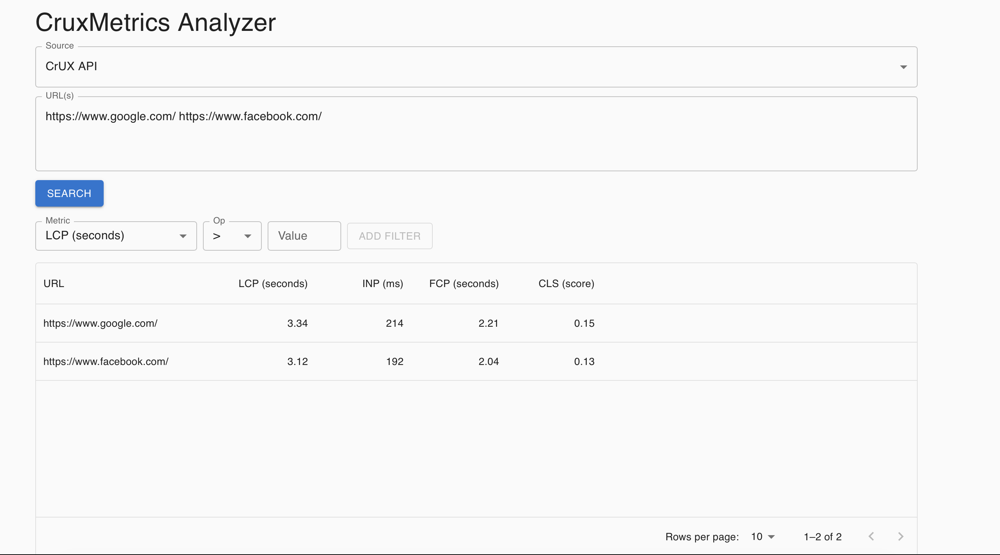
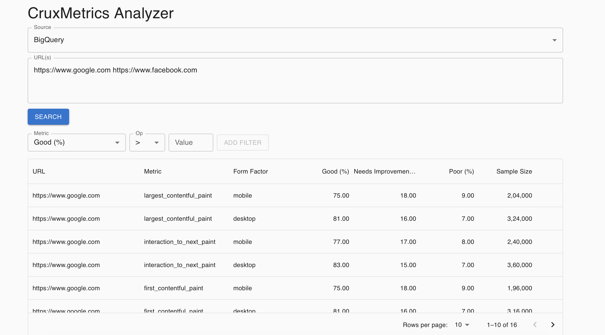

# CruxMetrics

CruxMetrics is a web performance analytics tool that uses Google Chrome UX Report (CrUX) data to help customers identify slow pages and provide actionable insights. This repository contains both a **React frontend** and a **Node.js/Express backend** with dummy data handling and future-ready CrUX API integrations.

> **⚠️ Note on CrUX API Data**
> The CrUX API integration is currently returning **hardcoded dummy data**. This is because we ran into issues obtaining/validating the CrUX API key. The dummy data in `backend/config/cruxApiDummyData.js` simulates realistic API responses so that the full UI and data-flow can be exercised end-to-end. Once a valid API key is available, swap `useDummyData = false` in `cruxService.js` and set `CRUX_API_KEY` in your `.env` file to enable live data.

---

ScreenShots -



## 📁 Project Structure

- `/frontend` - React application built with Vite.
- `/backend` - Express server handling API endpoints, dummy data, and future CrUX/BigQuery integration.
- `/IMPLEMENTATION_PLAN.md` - Detailed design & implementation roadmap.

---

## 🚀 Getting Started

### Prerequisites

- Node.js 18+ (LTS recommended)
- npm or yarn
- Frontend uses React 18 with MUI; ensure your environment supports React 18.
- (Optional) Google Cloud credentials for CrUX BigQuery access

### Running Locally

Open **two terminals** and run the backend and frontend concurrently.

#### 1. Backend

```bash
cd backend
npm install
cp .env.example .env   # add CRUX_API_KEY and other values if available
npm run dev            # starts Express on http://localhost:5000
```

#### 2. Frontend

```bash
cd frontend
npm install
npm run dev            # starts Vite dev server on http://localhost:5173
```

Open `http://localhost:5173` in your browser.

---

### ✅ No CORS Setup Required (Local)

The Vite dev server includes a built-in **reverse proxy** configured in [frontend/vite.config.js](frontend/vite.config.js). Any request the frontend makes to `/api/*` is automatically forwarded to `http://127.0.0.1:5000`, so the browser never sees a cross-origin request and **no CORS errors occur** out of the box.

Additionally, the Express backend already sets permissive CORS headers (`origin: true`) for development, so direct API calls (e.g. from Postman or curl) will also work without issues.

#### Running in a Remote Environment (GitHub Codespaces / Gitpod)

When the backend is exposed on a remote preview URL (e.g. `https://xxxx-5000.preview.app.github.dev`), the frontend proxy target must be updated. Set the `VITE_API_PROXY_TARGET` environment variable **before** starting the frontend:

```bash
export VITE_API_PROXY_TARGET="https://xxxx-5000.preview.app.github.dev"
npm run dev
```

This overrides the proxy target in `vite.config.js` and routes all `/api` calls to the correct remote backend URL, again avoiding any CORS issues in the browser.

---

## 📦 Features (implemented)

- Search by one or more URLs
- Choose data source: CrUX API or CrUX BigQuery
- Table view powered by Material UI DataGrid
- Client-side pagination, sorting, and filtering
- Frontend caching for recently fetched URLs
- Dummy data structures to simulate API responses
- Context-based state management (MetricsContext & CacheContext)
- Robust error handling with ErrorBoundary

---

## 🛠️ Backend Details

- **Controllers:** Request validation, logic, response formatting
- **Services:** `cruxService.js` & `bigQueryService.js` (with dummy data generation)
- **Utilities:** Validators, constants, logging, error handling
- **Routes**
  - `POST /api/crux-api`
  - `POST /api/crux-bigquery`
  - `GET /api/health` (health check)

Environmental variables are defined in `.env.example` under `/backend`.

---

## 🎨 Frontend Details

- **Contexts**: MetricsContext, CacheContext
- **Hooks**: `useCruxAPI`, `useFilters`, `useSort`, `usePagination`
- **Components**:
  - `SearchComponent` - URL input & source selector
  - `TableComponent` - MUI DataGrid wrapper
  - `PaginationComponent` - navigation controls
  - `LoadingSpinner`, `ErrorBoundary`, `EmptyState`

Styles are built with Material UI and simple CSS.

---

## 📌 Next Steps

1. Replace dummy data with real CrUX API calls once API key is available.
2. Integrate BigQuery with proper credentials.
3. Enhance filtering UI and caching strategy.

Refer to `IMPLEMENTATION_PLAN.md` for a full roadmap.
API URL (deployed to Render) - https://cruxmetrics.onrender.com
FE URL (depoyed to Vercel) - https://crux-metrics-five.vercel.app/
